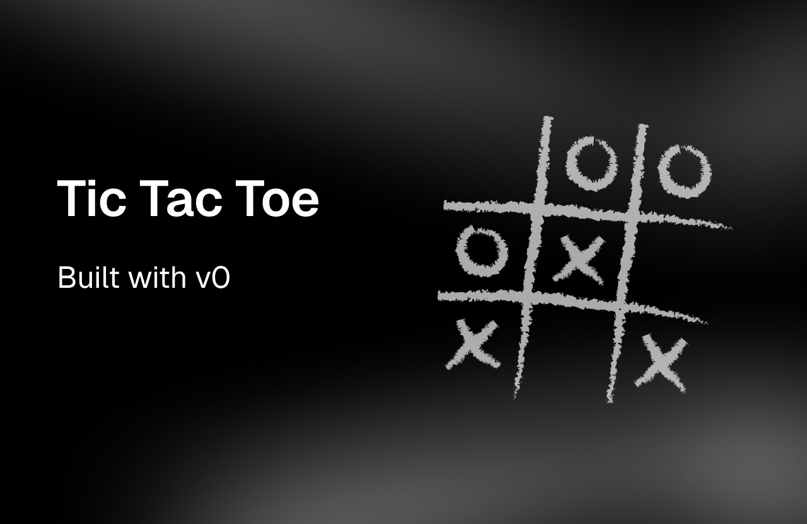

## tic‑tac‑toe

A minimal NextJS app with single player, local multiplayer, and Supabase‑powered online multiplayer.

[](https://tic-tac-toe-by-v0.vercel.app/)

### Prerequisites
- Node 18+ and pnpm
- A Supabase project (for online mode)

### Setup
1) Install dependencies:

```bash
pnpm install
```

2) Create `.env` in the project root:

```bash
NEXT_PUBLIC_SUPABASE_URL=your_supabase_url
NEXT_PUBLIC_SUPABASE_ANON_KEY=your_supabase_anon_key
```

3) Create the `rooms` table for online play (choose one):
- In Supabase Dashboard → SQL editor, run the contents of `scripts/setup-database.sql`.
- Or set `DATABASE_URL` and run:

```bash
chmod +x scripts/setup.sh
./scripts/setup.sh
```
**Important:**  
Be sure to enable **Realtime** for your Supabase project.  
You can do this from the Supabase Dashboard under **Database > Replication > Realtime**.

### Develop

```bash
pnpm dev
```

App runs on http://localhost:3000.

### Build & Start

```bash
pnpm build
pnpm start
```

### Scripts
- `pnpm dev` – start dev server
- `pnpm build` – build production bundle
- `pnpm start` – run production server
- `pnpm lint` – run linting
